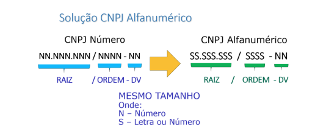

# CheckDigit.Documento

Biblioteca .NET para cálculo de dígitos verificadores de documentos brasileiros, como CPF e CNPJ, utilizando o algoritmo de Módulo 11. Ideal para validação, geração e conferência de documentos em sistemas fiscais, contábeis e administrativos.

## Funcionalidades

- **Cálculo de dígitos verificadores para CPF**
- **Cálculo de dígitos verificadores para CNPJ**
  - Suporte ao novo formato alfanumérico do CNPJ (Nota Técnica COCAD/SUARA/RFB nº 49/2024)
- **Compatibilidade com formatos tradicionais e atualizados**
- **Baseada na biblioteca [CheckDigit](https://github.com/marcoshidalgonunes/CheckDigit)**

## CNPJ Alfanumérico

O cálculo do dígito verificador (DV) do CNPJ foi atualizado para suportar o novo padrão estabelecido pela Receita Federal, que permite letras e números (CNPJ Alfanumérico). O formato tradicional, apenas numérico, continua suportado.



Na rotina de cálculo do DV para CNPJ alfanumérico:

- Cada caractere é convertido para seu valor decimal conforme a tabela ASCII, subtraindo 48.
- Caracteres numéricos mantêm seus valores originais.
- Caracteres alfanuméricos seguem a lógica: **A=17, B=18, C=19…** e assim por diante, garantindo compatibilidade com CNPJs apenas numéricos.

Veja a correspondência entre letras, números e seus valores ASCII:


## Instalação

Adicione uma referência para o pacote NuGet `CheckDigit.Documento` em seu projeto .Net ou instale-a via comando:

`dotnet add package CheckDigit.Documento`

## Exemplos de Uso

### Cálculo do dígito verificador de CPF

````csharp
using CheckDigit.Documento;

// CPF sem dígitos verificadores
string cpfBase = "123456789";
string cpfComDV = Cpf.CalcularDigitoVerificador(cpfBase);
// Retorna: "12345678909"
````

### Cálculo do dígito verificador de CNPJ numérico

````csharp
using CheckDigit.Documento;

// CNPJ sem dígitos verificadores
string cnpjBase = "123456780001";
string cnpjComDV = Cnpj.CalcularDigitoVerificador(cnpjBase);
// Retorna: "12345678000195"
````

### Cálculo do dígito verificador de CNPJ alfanumérico

````csharp
using CheckDigit.Documento;

// CNPJ alfanumérico sem dígitos verificadores
string cnpjAlfaBase = "12ABC34501DE";
string cnpjAlfaComDV = Cnpj.CalcularDigitoVerificador(cnpjAlfaBase);
// Retorna: "12ABC34501DE35" 
````

## Testes

Exemplos de uso e testes unitários estão disponíveis no projeto `CheckDigit.Documento.Tests` neste repositório.

## Licença

Esta bilbioteca é licenciada sob a [GNU General Public License v3.0](./LICENSE)

## Contribuição

Contribuidores são bemvindos! Por favor, submeta problemas ou _pull requests_ via GitHub.
