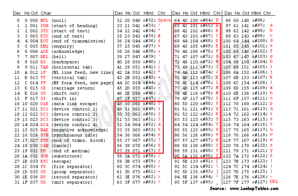

# CheckDigit.Documento

Biblioteca de rotinas para calcular dígitos verificadores de documentos usados no Brasil (CPF e CNPJ), conforme [Cálculo Digito Módulo 11](https://www.cjdinfo.com.br/utilitario-calculo-digito-modulo-11).

## CNPJ AlfaNumérico

O cálculo de CNPJ foi atualizado para suportar o novo formato estabelecido pela Receita Federal, que combina números e letras (CNPJ Alfanumérico), conforme a Nota Técnica COCAD/SUARA/RFB nº 49/2024. **O formato original somente com números permance suportado.**

Na rotina de cálculo do Dígito Verificador (DV) no CNPJ alfanumérico, **serão substituídos os valores numéricos e alfanuméricos pelo valor decimal correspondente ao código constante na tabela ASCII** e dele subtraído o valor 48. Desta forma os caracteres numéricos continuarão com os mesmos montantes.

Os caracteres alfanuméricos terão os seguintes valores: **A=17, B=18, C=19…** e assim sucessivamente. Esta definição mantém a compatibilidade com os CNPJs apenas numéricos quando começar a identificação alfanumérica.

O desenho abaixo mostra a correspondência entre letras e números e seus 
respectivos valores na tabela ASCII:

## Referências

Utiliza a biblioteca [CheckDigit](https://github.com/marcoshidalgonunes/CheckDigit) como base para calcular módulo 11, algoritmo usado nos dígitos verificadores de CPF e CNPj.
